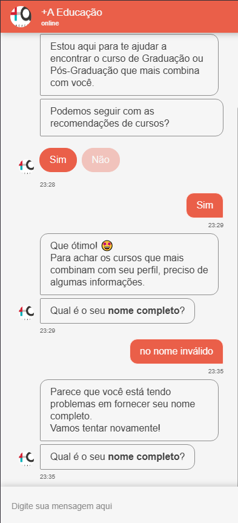
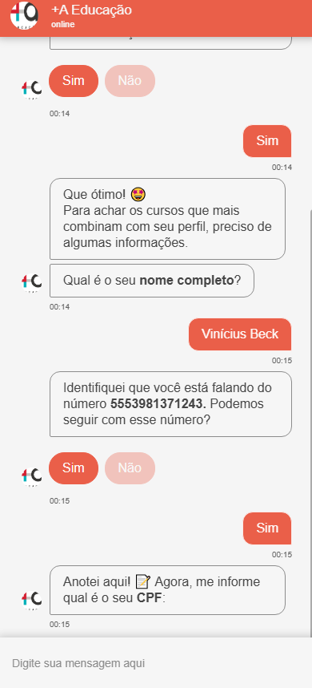
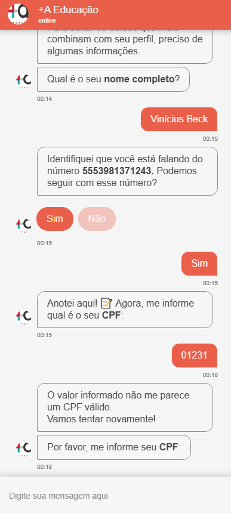
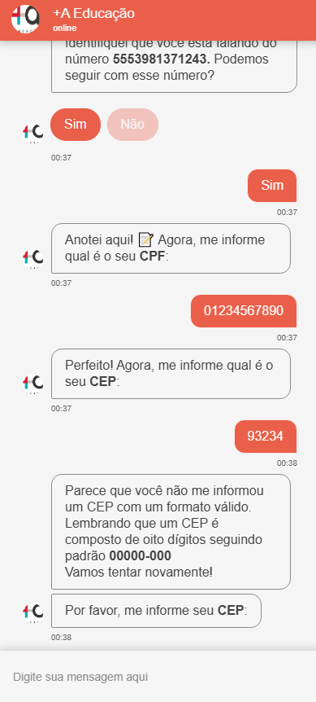
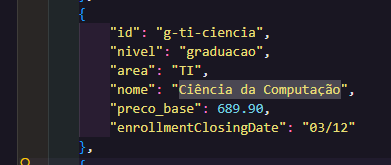
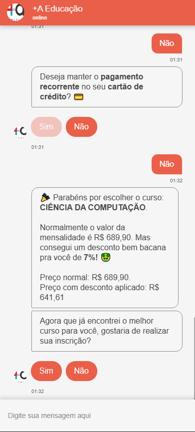

### Execução de testes 🧪
As evidências estão na ordem dos respectivos cenários
**Todos os inputs contém uma retentativa permitida**. Caso o usuário **erre uma segunda vez**, ele é direcionado para **atendimento humano**.

Anexarei o funcionamento desse fluxo de retentativas somente da primeira mensagem, apenas para informação.

---

## Pergunta sobre prosseguimento de atendimento

**Input válido com resposta "sim"**
- Deve seguir para a mensagem de necessidade de coleta de dados e logo após para a **coleta de nome completo**

**Input válido com resposta "não"**
- Deve exibir a mensagem de encerramento

**Primeiro input inválido**
- Deve informar que aceita apenas respostas de **"sim"** e **"não"** e refazer a pergunta

**Segundo input inválido**
- Deve direcionar para atendimento humano

    
    
     
    
    

## Feature flag de telefone

**Ativada**
- Deve informar o número de contato e perguntar se deseja seguir com ele

**Desativada**
- Deve seguir para a pergunta de telefone do usuário

    
    

## Pergunta nome completo

**Input válido**
- Deve seguir para a **coleta de telefone** (de acordo com a feature flag)

**Primeiro input inválido**
- Deve informar a mensagem sobre a dificuldade de fornecer um nome válido e refazer a pergunta

    
    

---

## Pergunta número de telefone

**Número válido**
- Deve seguir para a **coleta de cpf**

**Número inválido**
- Deve informar que o nome é inválido, explicar o padrão esperado e refazer a pergunta

    
    

---

## Pergunta CPF
**CPF válido**
- Deve seguir para a **coleta de CEP**

**CPF válido**
- Deve informar a mensagem de CPF inválido e refazer a pergunta

    
    

---

---

## Pergunta CEP
**CEP válido**
- Deve seguir para a **coleta de nível de ensino**

**CEP inválido**
- Deve exibir a mensagem informando o formato correto de um CEP e refazer a pergunta

    
    

---

## Urgência de lote
**Lote com urgência**
- Deve realizar o desconto de **7%** no final do carrinho

    
    

